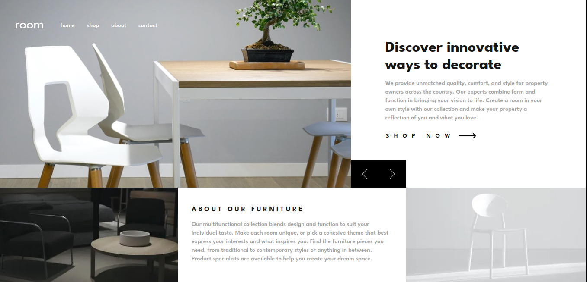

# Frontend Mentor - Solução para a página inicial do Room

Esta é uma solução para o [desafio da página inicial do Room no Frontend Mentor](https://www.frontendmentor.io/challenges/room-homepage-BtdBY_ENq). Os desafios do Frontend Mentor ajudam a melhorar suas habilidades de codificação ao construir projetos realistas.

## Sumário

- [Frontend Mentor - Solução para a página inicial do Room](#frontend-mentor---solução-para-a-página-inicial-do-room)
  - [Sumário](#sumário)
  - [Visão Geral](#visão-geral)
    - [O Desafio](#o-desafio)
    - [Captura de Tela](#captura-de-tela)
    - [Links](#links)
  - [Meu Processo](#meu-processo)
    - [Construído com](#construído-com)
    - [Desenvolvimento Contínuo](#desenvolvimento-contínuo)
  - [Autor](#autor)
  - [Agradecimentos](#agradecimentos)

## Visão Geral

### O Desafio

Os usuários devem ser capazes de:

- Visualizar o layout ideal para o site, dependendo do tamanho da tela do dispositivo
- Ver estados de hover para todos os elementos interativos na página
- Navegar pelo slider usando o mouse/trackpad ou teclado

### Captura de Tela

### Links

- URL da Solução: [Github](https://github.com/brunodavi/room-page)
- URL do Site: [Site](https://room-page-six.vercel.app)

## Meu Processo

### Construído com

- Marcação HTML5 Semântica
- Fluxo de trabalho 'Mobile-first'
- [React](https://reactjs.org) - Biblioteca JS
- [TypeScript](https://www.typescriptlang.org) - Pré-Compilador de JS Tipado
- [Next.js](https://nextjs.org) - Framework React
- [TailwindCSS](https://tailwindcss.com) - Para estilos
  - [DaisyUI](https://daisyui.com) - Biblioteca de estilos para TailwindCSS

### Desenvolvimento Contínuo

Nesta seção, pretendo concentrar meus esforços em aprimorar minha habilidade na estruturação eficiente de páginas, especialmente no que diz respeito à adaptação de layouts responsivos. Tenho o objetivo de desenvolver métodos mais elegantes que evitem a necessidade de criar múltiplos cabeçalhos para diferentes dispositivos, proporcionando uma transição suave entre diferentes tamanhos de tela.

Além disso, busco aperfeiçoar a estrutura geral dos meus projetos, adotando práticas mais eficazes e organizadas. Isso inclui explorar abordagens mais avançadas na gestão de estilos, componentes e funcionalidades, garantindo uma manutenção facilitada e uma base sólida para futuras expansões.

## Autor

- Website - [portfolio](https://brunodavi.vercel.app)
- Frontend Mentor - [@brunodavi](https://www.frontendmentor.io/profile/brunodavi)
- LinkedIn - [@brunodavi](https://www.linkedin.com/in/brunodavi)

## Agradecimentos

Agradeço o @tediko por ter feito projeto com várias animações na criação do mesmo desafio
servindo para mim como inspiração do que tenho a aprender

[Projeto citado](https://roomhomepage-tediko.netlify.app)
